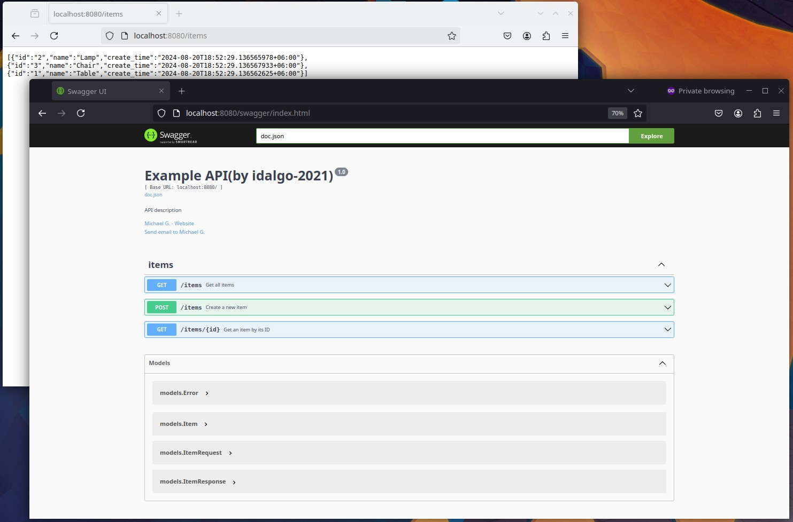

# Пример создания SWAG документации HTTP-API

* Генерация документации - https://github.com/swaggo/swag
* Маршрутизатор - https://github.com/gorilla/mux


Заметка:
```
go install github.com/swaggo/swag/cmd/swag@latest
go get -u github.com/swaggo/gin-swagger
go get -u github.com/swaggo/files
```
Аннотации пишутся вручную. Для пересборки описания API использовать:
```
swag init -g cmd/main.go //docs
```




